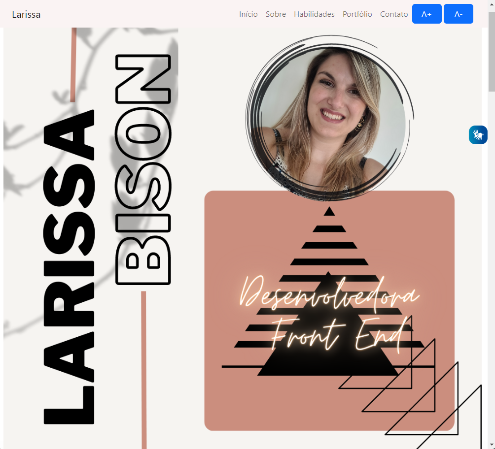

<h1 align="center"> Projeto Portfólio </h1>

Este projeto foi desenvolvido no Curso Do Zero ao Primeiro Site, ofertado pelo grupo +praTi.  

  <a href="#-estrutura">Estrutura</a>&nbsp;&nbsp;&nbsp;|&nbsp;&nbsp;&nbsp;
  <a href="#-framework">Framework</a>&nbsp;&nbsp;&nbsp;|&nbsp;&nbsp;&nbsp;
  <a href="#-fontes">Fontes</a>&nbsp;&nbsp;&nbsp;|&nbsp;&nbsp;&nbsp;
  <a href="#-acessibilidade">Acessibilidade</a>&nbsp;&nbsp;&nbsp;|&nbsp;&nbsp;&nbsp;
  <a href="#-projeto">Projeto</a>

 

  

## 🚀 Estrutura

Na construção do documento HTML foram utilizadas as seguintes estruturas básicas:

- *Sections* - utilizadas para dividir cada seção de conteúdo, definindo um bloco ou um grupo de assuntos específicos;
- *Divs* - com linhas e colunas na estrutura de certas seções específicas, usadas como container genérico para conteúdo de fluxo e posicionar objetos na página web;
- *Links* - para as principais seções do site;
- *Hiperlinks* - utilizados para abrir principais projetos em outra página web;
- *Buttons* – elementos em HTML que representa um botão clicável.
- *Functions* - utilizadas através de scripts com linhas de comando executáveis na página. 

 

## 🔖 Framework

### Bootstrap

    Framework de código-fonte aberto, utilizado em front-end, onde fornece estruturas de comandos básicos e funções adicionais em HTML, CSS e JavaScript para a criação de sites e aplicações responsivas de forma rápida e simples.

   
    Ele contém todos os tipos de templates para várias funções e componentes com o objetivo principal de criar sites responsivos e permite que a interface do usuário de um site seja otimizada para qualquer tamanho de tela, desde os dispositivos móveis até as telas mais robustas de computadores potentes.   

 

## Fontes

### Google Fonts

   
    Ferramenta destinada para personalizar a tipografia utilizada na construção dos textos de uma página, permitindo a utilização das fontes existentes e a criação de novas fontes, conforme a necessidade do usuário.

  

 

## 🔖 Acessibilidade

Na construção deste Projeto Portfólio procurei adaptar a página web com alguns recursos de acessibilidade como:

- O **VLibras Widget** – que consiste num recurso de acessibilidade desenvolvido para tornar páginas web acessíveis para pessoas surdas. Com a tradução automática de Português Brasileiro para a Língua Brasileira de Sinais (LIBRAS), essa ferramenta permite que usuários surdos sejam capazes de consumir conteúdos de texto em qualquer website.

- Também utilizei uma função em JavaScript para aumentar e diminuir o tamanho da fonte dos textos, tornando a página web mais acessível para as pessoas com visão reduzida.

 

## 💻 Projeto

O Portfólio é uma página web utilizada para expor alguns projetos pessoais.

- [Visite o projeto online](https://laribg.github.io/Portfolio-Larissa/)

---

Feito com ♥ by Laribg 